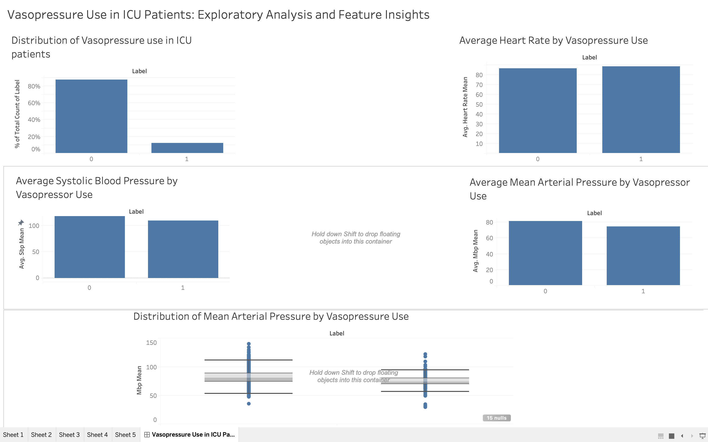

# Vasopressor Use Prediction in ICU Patients
### Machine Learning & Exploratory Analysis using MIMIC-IV

---

##  Project Overview  

This project analyzes ICU patient data from the **MIMIC-IV dataset** to predict vasopressor use and understand key clinical drivers influencing treatment decisions.  

It combines:
-  Machine Learning (BigQuery ML)
-  Clinical Feature Engineering
-  Interactive Visualization (Tableau)

The goal is to identify patients at risk of requiring vasopressors and interpret how physiological features relate to clinical interventions.

---

##  Objectives  

- Predict vasopressor use using ICU clinical data  
- Perform exploratory data analysis (EDA)  
- Understand feature importance and clinical relevance  
- Build an interactive dashboard for visual insights  
- Identify real-world issues like **data leakage** and **treatment effects**

---

##  Tableau Dashboard  

The dashboard summarizes key insights from the analysis:

### Key Visualizations:
- **Vasopressor Use Distribution** – Class balance  
- **Average MAP by Label** – Strong clinical signal  
- **Average SBP by Label** – Treatment effect insight  
- **Average Heart Rate by Label** – Weak predictor  
- **MAP Distribution (Box Plot)** – Full distribution comparison  

 These visualizations highlight how patient physiology differs between treated and non-treated groups.

---

##  Key Insights  

-  **Lower MAP strongly correlates with vasopressor use**  
   Clinically consistent (low perfusion → treatment)

-  **Higher SBP observed in treated patients**  
   Reflects post-treatment effect of vasopressors  

-  **Heart rate shows minimal separation**  
   Weak standalone predictor  

-  **Box plot confirms consistent MAP differences**  
   Not driven by outliers alone  

---

##  Machine Learning Approach  

### Models Used  

1. **Baseline Model**
   - Logistic Regression (BigQuery ML)

2. **Improved Model**
   - Logistic Regression with class weighting

3. **Final Model**
   - Boosted Tree Classifier (XGBoost-based)

---

###  Model Performance  

| Metric | Value |
|--------|------|
| Precision | 0.64 |
| Recall | 0.48 |
| F1 Score | 0.55 |
| ROC AUC | 0.86 |

 Threshold tuning improved recall from **32% → 48%**, enhancing detection of at-risk patients.

---

##  Important ML Findings  

- **Label leakage issue identified and fixed**
  - Incorrect vasopressor labeling initially led to unrealistic performance  
- **SOFA cardiovascular score excluded**
  - Avoided using features directly tied to treatment decisions  
- **Threshold tuning was critical**
  - Balanced precision vs recall for clinical relevance  

---

##  Feature Engineering  

### Clinical Features Used:

**Vital Signs**
- Heart Rate
- SBP, MAP, Respiratory Rate
- SpO2  

**Laboratory Values**
- WBC, Platelets
- Creatinine, BUN
- Bilirubin  

**Scores & Clinical Indicators**
- GCS  
- SOFA (excluding cardiovascular)  
- Urine Output  
- Charlson Index  

---

##  Data Source  

- **Dataset:** MIMIC-IV (PhysioNet)  
 https://physionet.org/content/mimiciv/

**Note:**  
Due to data use restrictions and ethical guidelines, the dataset is **not included** in this repository.  
Access requires credentialing, training, and a Data Use Agreement (DUA).

---

##  Tools & Technologies  

- **Google BigQuery & BigQuery ML**  
- **SQL**  
- **Tableau**  
- Clinical feature engineering  

---

##  Project Structure  

vasopressor-analysis/
│
├── dashboard/
│   └ vasopressor_dashboard.twb
│
├── sql/
│   ├── cohort.sql
│   ├── label_creation.sql
│   ├── feature_engineering.sql
│   ├── model_training.sql
│
├── images/
│   └── dashboard.png
│
├── README.md

--

##  Dashboard Preview  

---

##  How to Use  

1. Clone this repository  
2. Open `.twb` file in Tableau Desktop  
3. Connect to your own MIMIC-IV dataset  
4. Explore visualizations and insights  

---

##  Key Learnings  

- Importance of **correct label construction**  
- Identifying and fixing **data leakage**  
- Trade-offs between **precision and recall**  
- Handling **class imbalance**  
- Understanding **treatment effects in observational data**  
- Value of combining **ML + visualization**  

---

##  Future Improvements  

- Time-series modeling (trend-based features)  
- Predict vasopressor use in next 24 hours  
- Advanced model explainability (SHAP)  
- External validation on other datasets  
- Enhanced dashboard interactivity  

---

##  Author  

Vijeta Singh  
Data Analyst / Data Scientist  

---
